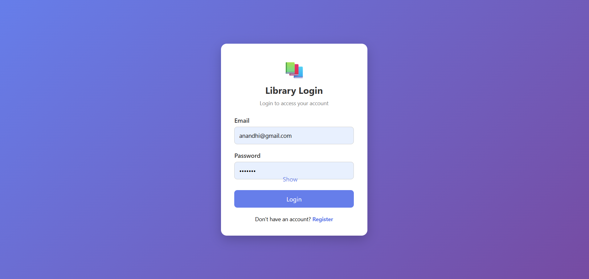
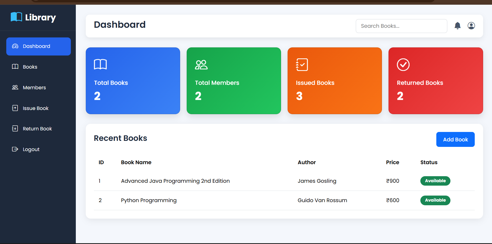
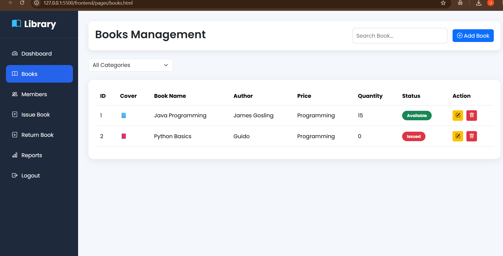

# Library Management System

A full-stack Library Management System built using Node.js, Express.js, MongoDB and HTML, CSS, JavaScript.

## Features

- User Registration and Login
- JWT Authentication
- Book Management (Add, Update, Delete, View)
- Member Management
- Issue and Return Books
- Dashboard Statistics

## Technologies Used

Frontend:
- HTML
- CSS
- JavaScript

Backend:
- Node.js
- Express.js
- MongoDB
- Mongoose
- JWT Authentication

## Project Structure

library-management-system
|
|-- backend
|
|-- frontend

## How to Run
## 📸 Project Screenshots

### Login Page

### Dashboard

### Books Management

### Backend
